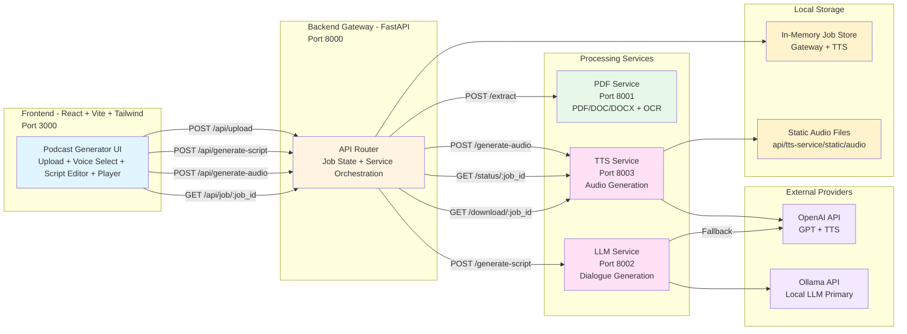

<p align="center">
  
</p>

# 🎧 Audify - Document to Podcast Generator

Microservices-based AI application that converts PDF, DOC, and DOCX documents into editable podcast scripts and downloadable audio episodes.


---

## 📋 Table of Contents

- [Project Overview](#project-overview)
- [Architecture](#architecture)
- [Get Started](#get-started)
  - [Prerequisites](#prerequisites)
  - [Quick Start](#quick-start)
- [Project Structure](#project-structure)
- [Usage Guide](#usage-guide)
- [Environment Variables](#environment-variables)
- [Technology Stack](#technology-stack)
- [Troubleshooting](#troubleshooting)
- [License](#license)
- [Disclaimer](#disclaimer)

---

## Project Overview

**Audify** is an end-to-end content transformation platform that ingests long-form documents, generates two-speaker podcast dialogue using LLMs, and synthesizes final MP3 audio with selectable AI voices.

### How It Works

1. **Upload and Extraction**: The frontend uploads a document to the backend gateway, which forwards the file to the PDF service for text extraction and OCR fallback.
2. **Script Generation**: The backend sends extracted text to the LLM service, which creates a host and guest dialogue script in structured JSON.
3. **Script Review and Editing**: Users review the generated script in the UI and optionally edit speaker turns before audio generation.
4. **Audio Synthesis and Delivery**: The TTS service converts each dialogue turn into speech, mixes segments into a single podcast file, and returns a downloadable audio stream.

The codebase is implemented as a FastAPI microservices stack with a React + Vite frontend and Docker Compose orchestration. It supports OpenAI-backed text-to-speech, Ollama-first script generation with OpenAI fallback, health checks across services, and asynchronous job polling through the backend gateway.

---

## Architecture

Audify separates extraction, language generation, and speech synthesis into dedicated services behind a single gateway API for the frontend.



### Architecture Components

**Frontend (React + Vite)**
- Multi-step workflow UI for upload, voice selection, generation progress, script editing, and playback.
- Uses `ui/src/services/api.js` for gateway communication and polling.

**Backend Gateway (FastAPI)**
- Routes frontend requests to the PDF, LLM, and TTS services.
- Stores job metadata in memory and proxies status/download endpoints.

**PDF Service**
- Extracts text from PDF, DOC, and DOCX.
- Uses OCR fallback for scanned PDFs when low text is detected.

**LLM Service**
- Generates podcast dialogue using Ollama as primary and OpenAI as fallback.
- Supports tone control (`conversational`, `educational`, `professional`) and script refinement.

**TTS Service**
- Generates turn-by-turn speech and mixes output into MP3 podcasts.
- Exposes voices, voice samples, status tracking, and downloadable audio.

**External Integrations**
- **OpenAI**: used for LLM fallback and TTS generation.
- **Ollama**: local model endpoint for primary script generation path.

---

## Get Started

### Prerequisites

Before you begin, ensure you have the following installed and configured:

- **Docker Engine** (24.x+)
  - [Install Docker](https://docs.docker.com/get-docker/)
  - [Docker Docs](https://docs.docker.com/)
- **Docker Compose Plugin** (v2+)
  - [Install Compose](https://docs.docker.com/compose/install/)
  - [Compose Reference](https://docs.docker.com/compose/)
- **OpenAI API Key** (required for TTS, optional fallback for LLM)
  - [Create API Key](https://platform.openai.com/api-keys)
  - [Usage Dashboard](https://platform.openai.com/usage)
- **Ollama** (optional but recommended for local-first script generation)
  - [Install Guide (macOS, Windows, Linux)](./docs/OLLAMA_INSTALL.md)
  - [Official Ollama Documentation](https://github.com/ollama/ollama)

#### Verify Installation

```bash
# Check Docker and Compose
docker --version
docker compose version

# Check Docker daemon
docker info
```

### Quick Start

#### 1. Clone or Navigate to Repository

```bash
git clone git@github-work:cld2labs/Audify.git
cd Audify
```

#### 2. Configure Environment Variables

Create root `.env` for the backend gateway:

```bash
cat > .env << 'EOF'
CORS_ORIGINS=http://localhost:3000
PDF_SERVICE_URL=http://pdf-service:8001
LLM_SERVICE_URL=http://llm-service:8002
TTS_SERVICE_URL=http://tts-service:8003
BACKEND_API_URL=http://localhost:8000
MAX_FILE_SIZE=10485760
NODE_ENV=development
PYTHON_ENV=development
EOF
```

Create `api/llm-service/.env`:

```bash
cat > api/llm-service/.env << 'EOF'
SERVICE_PORT=8002
OPENAI_API_KEY=sk-live-key
OLLAMA_BASE_URL=http://host.docker.internal:11434/v1
OLLAMA_MODEL=qwen3:1.7b
DEFAULT_MODEL=gpt-4o-mini
DEFAULT_TONE=conversational
DEFAULT_MAX_LENGTH=2000
TEMPERATURE=0.7
MAX_TOKENS=4000
MAX_RETRIES=3
EOF
```

You can use any Ollama-compatible model available on your machine, such as `qwen3:1.7b`, `llama3`, or `mistral`.

Create `api/tts-service/.env`:

```bash
cat > api/tts-service/.env << 'EOF'
SERVICE_PORT=8003
OPENAI_API_KEY=sk-live-key
TTS_MODEL=tts-1-hd
DEFAULT_HOST_VOICE=alloy
DEFAULT_GUEST_VOICE=nova
OUTPUT_DIR=static/audio
AUDIO_FORMAT=mp3
AUDIO_BITRATE=192k
SILENCE_DURATION_MS=500
MAX_CONCURRENT_REQUESTS=5
MAX_SCRIPT_LENGTH=100
EOF
```

#### 3. Launch the Application

**Option A: Full Docker Stack**

```bash
# Build and run all services
docker compose up --build -d
```

**Option B: Logs in Foreground**

```bash
# Run with live logs
docker compose up --build
```

#### 4. Access the Application

Once running, access:

- **Frontend**: http://localhost:3000
- **Backend Gateway API**: http://localhost:8000
- **PDF Service Docs**: http://localhost:8001/docs
- **LLM Service Docs**: http://localhost:8002/docs
- **TTS Service Docs**: http://localhost:8003/docs

#### 5. Verify Services

```bash
# Gateway health
curl http://localhost:8000/health

# Individual service health
curl http://localhost:8001/health
curl http://localhost:8002/health
curl http://localhost:8003/health

# Container status
docker compose ps
```

#### 6. Stop the Application

```bash
# Stop containers
docker compose down

# Stop and remove volumes
docker compose down -v
```

---

## Project Structure

```text
Audify/
├── api/
│   ├── pdf-service/
│   │   ├── app/
│   │   │   ├── api/routes.py            # /extract, /extract-structure, /extract-with-ocr
│   │   │   ├── core/                    # PDF extraction, OCR, text cleaning, DOC/DOCX parsing
│   │   │   ├── config.py                # PDF service settings
│   │   │   └── main.py                  # FastAPI entrypoint (8001)
│   │   ├── requirements.txt
│   │   └── Dockerfile
│   ├── llm-service/
│   │   ├── app/
│   │   │   ├── api/routes.py            # /generate-script, /refine-script, /validate-content
│   │   │   ├── core/                    # LLM client, prompt builder, dialogue generator
│   │   │   ├── prompts/                 # Prompt templates
│   │   │   ├── config.py                # LLM service settings
│   │   │   └── main.py                  # FastAPI entrypoint (8002)
│   │   ├── requirements.txt
│   │   └── Dockerfile
│   └── tts-service/
│       ├── app/
│       │   ├── api/routes.py            # /generate-audio, /status, /download, /voices
│       │   ├── core/                    # TTS client, audio generator, mixer, voice manager
│       │   ├── config/voices.json       # Voice metadata and defaults
│       │   ├── config.py                # TTS service settings
│       │   └── main.py                  # FastAPI entrypoint (8003)
│       ├── static/audio/                # Generated podcast output
│       ├── requirements.txt
│       └── Dockerfile
├── ui/
│   ├── src/
│   │   ├── pages/                       # Home, Projects, Settings, PodcastGenerator
│   │   ├── components/                  # Upload, voice selector, script editor, audio player
│   │   ├── services/api.js              # Axios API client
│   │   ├── store/                       # Redux store and slices
│   │   └── main.jsx                     # React entrypoint
│   ├── package.json
│   ├── vite.config.js
│   └── Dockerfile
├── simple_backend.py                    # Gateway service implementation (8000)
├── docker-compose.yml                   # Multi-service orchestration
├── .env.example                         # Gateway environment template
├── docs/                                # Additional architecture and flow docs
└── README.md                            # Project documentation
```

---

## Usage Guide

### Using Audify

1. **Upload a Document**
  - Open **http://localhost:3000** and navigate to the generator page.
  - Upload a `.pdf`, `.doc`, or `.docx` document.

2. **Select Voices**
  - Choose **Host Voice** and **Guest Voice** from available TTS options.
  - Defaults are optimized for conversation pacing (`alloy` + `echo`/`nova`).

3. **Generate Script**
  - Click **Generate Script** to trigger LLM processing.
  - Wait for progress updates while the UI polls `/api/job/{job_id}`.

4. **Edit Script**
  - Review generated dialogue in **Script Editor**.
  - Modify turns, wording, and flow before final audio generation.

5. **Generate Audio**
  - Click **Generate Audio** to enqueue TTS generation.
  - The backend tracks job state and confirms completion when the MP3 is ready.

6. **Play and Download**
  - Use **Audio Player** to preview the generated podcast.
  - Download the episode from `/api/download/{job_id}`.

### Performance Tips

- **Document Size**: Keep uploads under `10MB` for reliable extraction and shorter processing times.
- **Script Length**: Use `max_length` around `1200-2000` words for balanced quality and latency.
- **Voice Pairing**: Use contrasting voices (`alloy` + `shimmer`, `onyx` + `nova`) for clearer host/guest separation.
- **Local LLM Stability**: Keep Ollama running before script generation to avoid fallback delays.

### API Endpoint Matrix

| Service | Endpoint | Method | Purpose |
|---------|----------|--------|---------|
| Gateway (`:8000`) | `/api/upload` | `POST` | Upload document and trigger extraction |
| Gateway (`:8000`) | `/api/generate-script` | `POST` | Generate host/guest podcast script |
| Gateway (`:8000`) | `/api/generate-audio` | `POST` | Start audio generation from script |
| Gateway (`:8000`) | `/api/job/{job_id}` | `GET` | Poll job state and progress |
| Gateway (`:8000`) | `/api/download/{job_id}` | `GET` | Download generated MP3 |
| PDF Service (`:8001`) | `/extract` | `POST` | Extract text from PDF, DOC, DOCX |
| LLM Service (`:8002`) | `/generate-script` | `POST` | Build dialogue from extracted text |
| TTS Service (`:8003`) | `/generate-audio` | `POST` | Create podcast audio from dialogue |
| TTS Service (`:8003`) | `/voices` | `GET` | List available TTS voices |

---

## Environment Variables

Configure the application behavior using environment variables in `.env`, `api/llm-service/.env`, and `api/tts-service/.env`:

| Variable | Description | Default | Type |
|----------|-------------|---------|------|
| `CORS_ORIGINS` | Allowed frontend origin for gateway CORS | `http://localhost:3000` | string |
| `PDF_SERVICE_URL` | Internal URL for PDF service | `http://pdf-service:8001` | string |
| `LLM_SERVICE_URL` | Internal URL for LLM service | `http://llm-service:8002` | string |
| `TTS_SERVICE_URL` | Internal URL for TTS service | `http://tts-service:8003` | string |
| `BACKEND_API_URL` | Public gateway URL used by frontend | `http://localhost:8000` | string |
| `MAX_FILE_SIZE` | Max upload size in bytes | `10485760` | integer |
| `NODE_ENV` | Frontend/runtime environment mode | `development` | string |
| `PYTHON_ENV` | Python runtime environment mode | `development` | string |
| `OPENAI_API_KEY` | OpenAI API key (REQUIRED for TTS; optional LLM fallback) | - | string |
| `SERVICE_PORT` | Per-service FastAPI port (`8001`,`8002`,`8003`) | service-specific | integer |
| `OLLAMA_BASE_URL` | Ollama OpenAI-compatible endpoint | `http://host.docker.internal:11434/v1` | string |
| `OLLAMA_MODEL` | Ollama model name (any installed model) | `qwen3:1.7b` | string |
| `DEFAULT_MODEL` | Fallback OpenAI model in LLM service | `gpt-4o-mini` | string |
| `DEFAULT_TONE` | Default script tone | `conversational` | string |
| `DEFAULT_MAX_LENGTH` | Default script word target | `2000` | integer |
| `TEMPERATURE` | LLM generation temperature (`0.0-1.0`) | `0.7` | float |
| `MAX_TOKENS` | Max response tokens per LLM call | `4000` | integer |
| `MAX_RETRIES` | Retry attempts for LLM calls | `3` | integer |
| `TTS_MODEL` | OpenAI TTS model ID | `tts-1-hd` | string |
| `DEFAULT_HOST_VOICE` | Default host voice ID | `alloy` | string |
| `DEFAULT_GUEST_VOICE` | Default guest voice ID | `nova` | string |
| `OUTPUT_DIR` | Audio output directory for TTS service | `static/audio` | string |
| `AUDIO_FORMAT` | Export format | `mp3` | string |
| `AUDIO_BITRATE` | Export bitrate | `192k` | string |
| `SILENCE_DURATION_MS` | Silence inserted between dialogue turns | `500` | integer |
| `MAX_CONCURRENT_REQUESTS` | Max parallel TTS requests | `5` | integer |
| `MAX_SCRIPT_LENGTH` | Max dialogue turns accepted by TTS service | `100` | integer |
| `VITE_API_URL` | Frontend API base URL | `http://localhost:8000` | string |

**Note:**
The gateway and TTS services currently use in-memory job stores. Jobs reset on container restart unless persistent storage is added.

---

## Technology Stack

### Backend
- **Gateway Framework**: FastAPI (`simple_backend.py`) for frontend-facing orchestration.
- **PDF Processing**:
  - `pdfplumber` (layout-aware extraction)
  - `PyPDF2` (fallback extraction)
  - `pytesseract` + `pdf2image` (OCR for scanned documents)
  - `python-docx` (DOCX extraction)
- **LLM Layer**:
  - Ollama-compatible OpenAI client path (local-first)
  - OpenAI fallback support
  - `tenacity` retry strategy for resilience
- **TTS Layer**:
  - OpenAI TTS API integration
  - `pydub` and `ffmpeg-python` for audio stitching and export
- **Server**: Uvicorn ASGI runtime for all FastAPI services.
- **Orchestration**: Docker Compose for multi-container local deployment.

### Frontend
- **Framework**: React 18 with functional components and hooks.
- **Build Tool**: Vite (dev server and build pipeline).
- **Styling**: Tailwind CSS with reusable UI component patterns.
- **State Management**: Redux Toolkit + React Redux slices.
- **Routing**: React Router v6.
- **Networking**: Axios with interceptors and long-request timeout support.
- **UX Tooling**: WaveSurfer.js, Framer Motion, React Hot Toast, Lucide icons.

---

## Troubleshooting

Encountering issues? Check the following:

### Common Issues

**Issue**: `docker compose up` fails on missing service `.env` files
```bash
# Confirm env files exist
ls -la api/llm-service/.env api/tts-service/.env

# If missing, create them from the README Quick Start section
```

**Issue**: Upload succeeds but script generation fails
- Verify LLM service health: `curl http://localhost:8002/health`.
- Confirm Ollama is running and model is available (`OLLAMA_MODEL=qwen3:1.7b` or any installed Ollama model).
- If Ollama is unavailable, set valid `OPENAI_API_KEY` for fallback.
- Check logs: `docker compose logs --tail=200 llm-service backend`.

**Issue**: Audio generation stalls or fails
- Verify `OPENAI_API_KEY` is set in `api/tts-service/.env`.
- Confirm TTS health: `curl http://localhost:8003/health`.
- Check FFmpeg availability inside container via logs.
- Reduce script size if near `MAX_SCRIPT_LENGTH`.

**Issue**: Voices are not displayed correctly in UI
- Check gateway response: `curl http://localhost:8000/api/voices`.
- Confirm frontend expects `voices` array shape.
- Restart frontend after API contract changes: `docker compose restart frontend`.
- Review browser console for `/api/voices` parsing errors.

### Debug Mode

Enable debug logging:

```bash
# Run stack in foreground to inspect live logs
docker compose up --build

# In another terminal, tail specific services
docker compose logs -f backend pdf-service llm-service tts-service frontend
```

---

## License

This project currently does not include a published license file. Add a `LICENSE.md` before distributing or reusing in external projects.

---

## Disclaimer

**Audify** is provided as-is for AI-assisted document-to-audio generation. While we strive for accuracy:

- Always review generated scripts before publishing.
- Do not rely solely on model output for legal, medical, financial, or compliance-critical content.
- Validate OCR output quality for scanned documents.
- Test generated audio and dialogue for factual correctness and tone suitability.

For deployment in regulated environments, add an explicit policy and usage disclaimer document to this repository.

---
