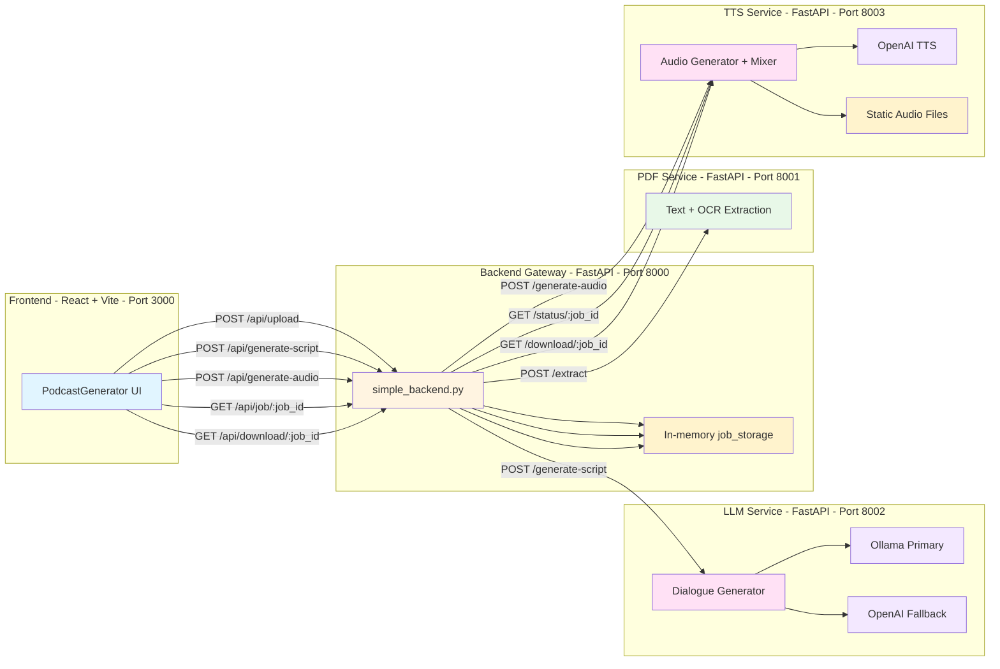

# Audify Architecture and Service Flow

## Overview

**Audify** is a document-to-podcast platform built with a React frontend and FastAPI microservices.  
The pipeline converts `.pdf`, `.doc`, and `.docx` files into:

1. extracted text,
2. generated two-speaker script,
3. downloadable MP3 podcast audio.

---

## System Architecture

---

## Service Responsibilities

### Frontend (`ui/`)
- Multi-step flow orchestrated by `ui/src/pages/PodcastGenerator.jsx`.
- Polls job status via `GET /api/job/{job_id}`.
- Uses `ui/src/services/api.js` for gateway calls.

### Backend Gateway (`simple_backend.py`)
- Routes document extraction, script generation, and audio generation requests.
- Stores per-job data in in-memory `job_storage`.
- Proxies audio download endpoint to TTS service.
- Exposes `/api/voices` and `/api/voice/sample/{voice_id}`.

### PDF Service (`api/pdf-service`)
- Extracts text from PDF, DOC, and DOCX.
- Uses OCR fallback for scanned PDFs.
- Provides extraction metadata (word count, method, etc).

### LLM Service (`api/llm-service`)
- Generates dialogue scripts from extracted text.
- Supports local-model-first path through Ollama, with OpenAI fallback.
- Includes optional strategy path for smaller local models (Blueprint flow).

### TTS Service (`api/tts-service`)
- Accepts script turns and generates segment audio with OpenAI TTS.
- Mixes segments into final MP3 output.
- Exposes voice list, status, and download endpoints.

---

## End-to-End Request Flow

### Step 1: Upload and Extract
1. Frontend sends `POST /api/upload` with a document.
2. Gateway forwards file to PDF service `POST /extract`.
3. Gateway stores extracted text under generated `job_id`.
4. Frontend receives `job_id`.

### Step 2: Generate Script
1. Frontend sends `POST /api/generate-script` with `job_id` and voice choices.
2. Gateway reads extracted text from `job_storage`.
3. Gateway calls LLM service `POST /generate-script`.
4. Gateway stores generated script in `job_storage[job_id]`.

### Step 3: Generate Audio
1. Frontend sends `POST /api/generate-audio` with `job_id` and script payload.
2. Gateway forwards to TTS service `POST /generate-audio`.
3. TTS runs background processing and updates TTS job state.
4. Gateway polls TTS status when frontend checks `/api/job/{job_id}`.
5. On completion, frontend downloads audio via `/api/download/{job_id}`.

---

## API Surface

### Gateway (Port 8000)
- `POST /api/upload`
- `POST /api/generate-script`
- `POST /api/generate-audio`
- `GET /api/job/{job_id}`
- `GET /api/download/{job_id}`
- `GET /api/voices`
- `GET /api/voice/sample/{voice_id}`
- `GET /health`

### PDF Service (Port 8001)
- `POST /extract`
- `POST /extract-structure`
- `POST /extract-with-ocr`
- `GET /health`
- `GET /languages`

### LLM Service (Port 8002)
- `POST /generate-script`
- `POST /refine-script`
- `POST /validate-content`
- `GET /health`
- `GET /tones`
- `GET /models`

### TTS Service (Port 8003)
- `POST /generate-audio`
- `GET /status/{job_id}`
- `GET /download/{job_id}`
- `GET /voices`
- `GET /voice-sample/{voice_id}`
- `GET /health`

---

## Data and State Model

### Gateway Job State (`job_storage`)
Each `job_id` may contain:
- `text`
- `metadata`
- `filename`
- `script`
- `host_voice`
- `guest_voice`
- `audio_generating`
- `audio_generated`
- `tts_job_id`
- `audio_url`
- `audio_status`

### TTS Job State (`jobs` dictionary)
Each TTS job tracks:
- `status` (`queued`, `processing`, `completed`, `failed`)
- `progress` (0-100)
- `message`
- `audio_url`
- `metadata`

---

## Current Constraints

- Gateway and TTS job states are in-memory and reset on restart.
- Voice selector UI currently renders local hardcoded options in `VoiceSelector.jsx`.
- `scriptStyle` and `targetAudience` from frontend are sent to gateway, but not fully mapped through gateway payload to LLM request fields.
- No persistent database for projects or job history in current implementation.

---

## Recommended Next Architecture Upgrades

1. Move gateway/TTS job state to Redis or database for persistence.
2. Normalize voice payload shape between gateway and frontend.
3. Map `scriptStyle` and `targetAudience` explicitly through gateway to LLM service.
4. Add structured observability (request IDs, traces, metrics).
5. Add queue-based orchestration for long-running generation tasks.
