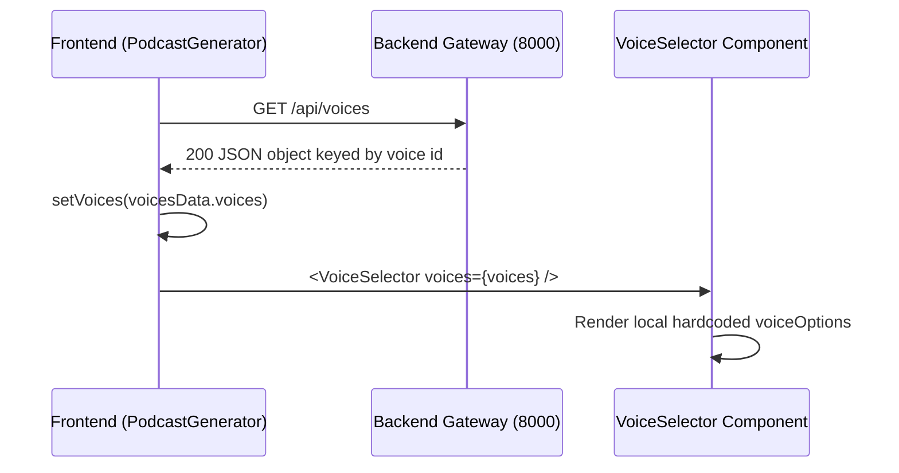

# Voice Display Flow in Audify

## Scope

This document explains how voice options are currently loaded and displayed in the Audify frontend, and where the data contract is misaligned.

---

## High-Level Flow



---

## Actual Behavior

### 1. Voices are fetched on page mount

`ui/src/pages/PodcastGenerator.jsx`:
- `useEffect(() => fetchVoices(), [])`
- `fetchVoices()` calls `getVoices()` from `ui/src/services/api.js`
- API endpoint: `GET /api/voices`

### 2. Gateway returns voice data

`simple_backend.py` has a working `/api/voices` endpoint that currently returns an object keyed by voice ID:

```json
{
  "alloy": { "name": "Alloy", "description": "...", "gender": "neutral" },
  "echo": { "name": "Echo", "description": "...", "gender": "male" }
}
```

### 3. Frontend expects a different payload shape

`PodcastGenerator.jsx` expects:

```json
{
  "voices": [ ... ]
}
```

Specifically, it does:

```javascript
const voicesData = await getVoices();
setVoices(voicesData.voices);
```

When the response is keyed-object format, `voicesData.voices` is `undefined`.

### 4. VoiceSelector still works because it does not use `voices` prop

`ui/src/components/VoiceSelector.jsx` defines a local `voiceOptions` array and renders that array directly.

Result:
- UI still shows voices.
- Display is not driven by API response.
- Gateway and frontend contracts are currently inconsistent.

---

## Step-by-Step UI Timeline

1. Component mounts with `step = 1`.
2. `fetchVoices()` runs and calls `GET /api/voices`.
3. Response arrives, but `setVoices(voicesData.voices)` sets `undefined`.
4. User uploads document and moves to step 2.
5. `VoiceSelector` renders hardcoded options (`alloy`, `echo`, `fable`, `onyx`, `nova`, `shimmer`).
6. User selects host and guest voices and continues workflow.

---

## Current Data Contract Gap

### Gateway output (current)
- Shape: object keyed by voice id.

### Frontend expectation (current)
- Shape: array under `voices`.

### VoiceSelector implementation (current)
- Ignores API-provided `voices` prop.
- Uses local array regardless of API payload.

---

## Recommended Fix Plan

### Option A (preferred): normalize gateway response
Update `/api/voices` in `simple_backend.py` to return:

```json
{
  "voices": [
    { "id": "alloy", "name": "Alloy", "description": "Neutral and balanced", "gender": "neutral" }
  ],
  "default_host": "alloy",
  "default_guest": "nova"
}
```

This aligns with TTS service shape and frontend expectation.

### Option B: adapt frontend parser
In `PodcastGenerator.jsx`, support both shapes:
- array in `voices`
- keyed object at root

### Option C: remove hardcoded UI list
Refactor `VoiceSelector.jsx` to render from `voices` prop and fallback to local defaults only when API data is unavailable.

---

## Related Files

- `ui/src/pages/PodcastGenerator.jsx`
- `ui/src/services/api.js`
- `ui/src/components/VoiceSelector.jsx`
- `simple_backend.py`
- `api/tts-service/app/api/routes.py`
