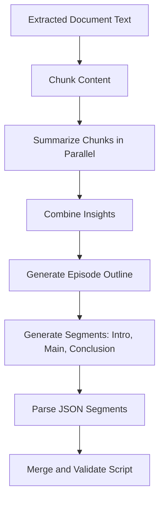

# Local Script Generation Architecture (Ollama)

## Purpose

This document describes how Audify handles local-model script generation using Ollama and where the Blueprint strategy is used in code.

---

## Runtime Strategy

Audify has two generation paths inside `DialogueGenerator`:

1. **Standard single-shot generation**
2. **Blueprint strategy (Map-Reduce-Expand)**

The Blueprint path is intended for smaller local models and large documents.

---

## Current Code Behavior

### LLM client selection

`api/llm-service/app/core/llm_client.py`:
- Initializes Ollama client using OpenAI-compatible API (`OLLAMA_BASE_URL`).
- Initializes OpenAI client only if `OPENAI_API_KEY` is present.
- During generation, tries Ollama first and falls back to OpenAI on failure.

### Strategy dispatch

`api/llm-service/app/core/dialogue_generator.py`:
- Uses Blueprint strategy when `provider == "ollama"`.
- Otherwise uses standard generation path.

### Current gateway request

`simple_backend.py` calls LLM service without setting `provider`, so default request model value is `openai`.  
Because LLM client attempts Ollama first internally, Ollama still acts as primary engine in many cases, but the explicit Blueprint strategy is not guaranteed unless request provider is set to `"ollama"`.

---

## Blueprint Method (Implemented)

### Step details

1. **Chunking**
- Splits source text into chunks (heuristic chunk size in code).

2. **Parallel summarization**
- Summarizes chunks with a semaphore to limit concurrency.

3. **Outline generation**
- Builds a global structure from chunk insights.

4. **Segment expansion**
- Generates script segments (`Introduction`, `Main Discussion`, `Conclusion`).

5. **Assembly and validation**
- Parses segment JSON and merges into final script.
- Applies shared post-processing and metadata generation.

---

## Model Configuration

Recommended local model default for this project:
- `OLLAMA_MODEL=qwen3:1.7b`

You can use any installed Ollama model, such as:
- `qwen3:1.7b`
- `llama3`
- `mistral`

---

## Fallback Behavior

Fallback to OpenAI occurs when:
- Ollama endpoint is unreachable,
- model invocation fails,
- response content is invalid/empty for downstream parsing,
- or Blueprint strategy raises an exception and fallback key is available.

If `OPENAI_API_KEY` is not configured and Ollama fails, script generation fails.

---

## Practical Recommendations

1. Set `OLLAMA_MODEL=qwen3:1.7b` for fast local inference.
2. Keep `OPENAI_API_KEY` configured for resilience.
3. If you want deterministic Blueprint usage, pass `provider="ollama"` from gateway to LLM service.
4. Add request-level observability fields (`provider_used`, `fallback_used`) in LLM responses.

---

## Related Files

- `api/llm-service/app/core/llm_client.py`
- `api/llm-service/app/core/dialogue_generator.py`
- `api/llm-service/app/core/prompt_builder.py`
- `api/llm-service/app/api/routes.py`
- `simple_backend.py`
